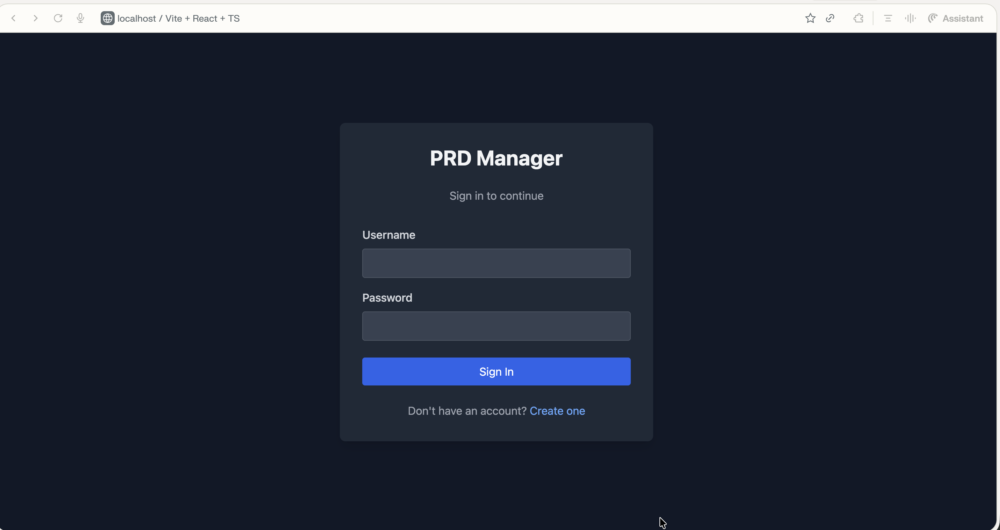
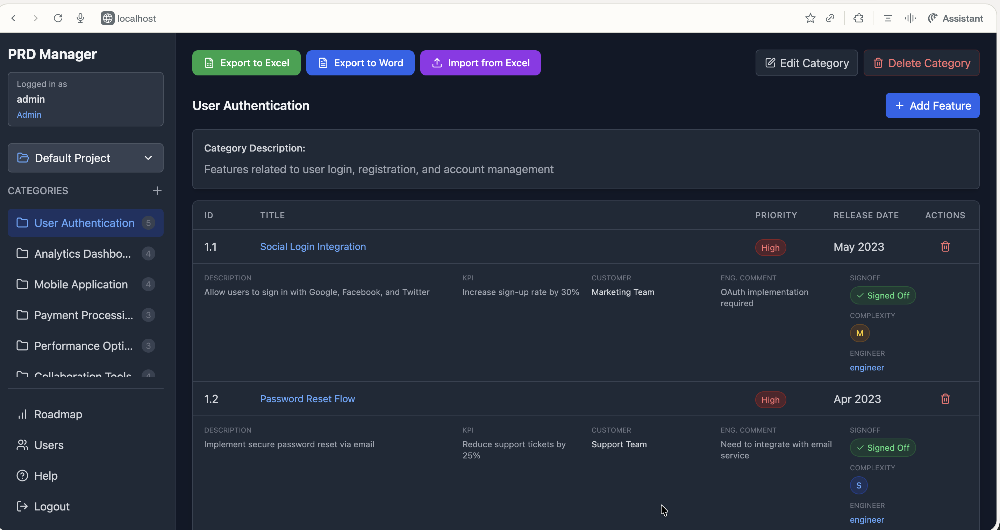
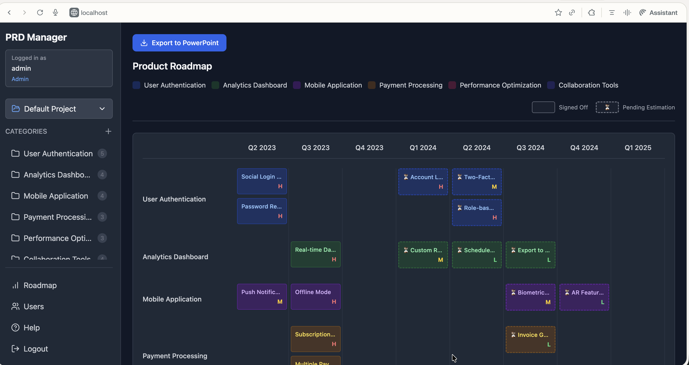
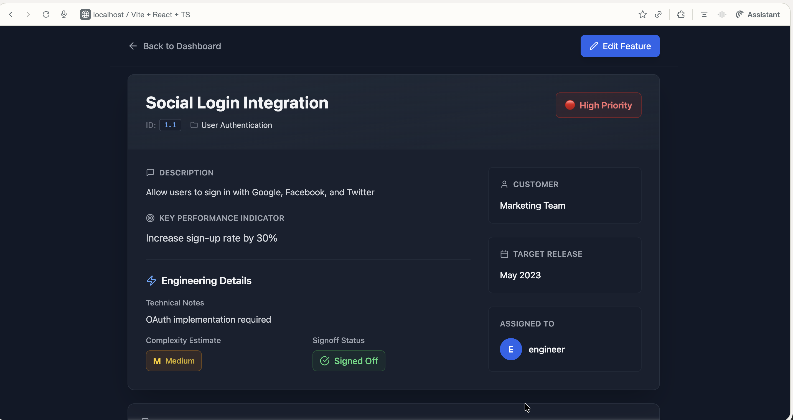
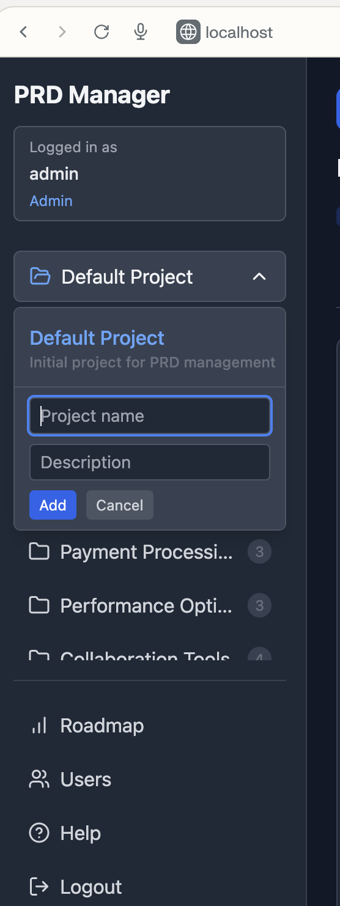
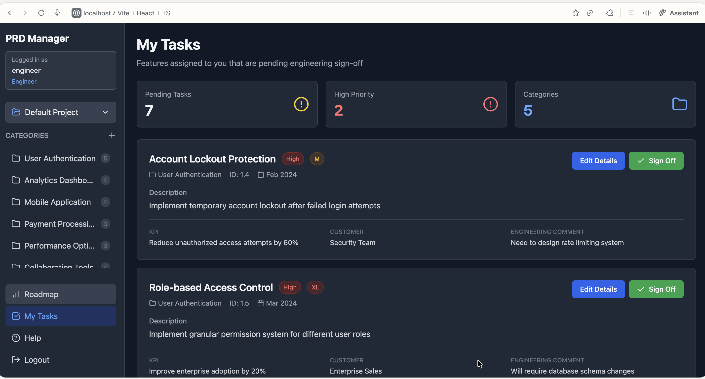
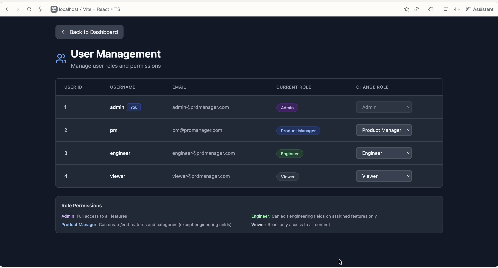

# PRD Manager

A full-stack Product Requirements Document (PRD) management application built with Flask (Python), React (TypeScript), and SQLite.

## Overview

PRD Manager helps product and engineering teams organize, track, and visualize product features across different categories with comprehensive metadata including priorities, engineering complexity, release dates, and stakeholder feedback.

**Key Features:**
- ✅ User authentication with JWT tokens
- ✅ Category management with CRUD operations
- ✅ Feature tracking with 9 metadata fields
- ✅ Product roadmap timeline visualization (quarterly)
- ✅ Export roadmap to PowerPoint (PPTX) with pending estimation indicators
- ✅ Export PRD to Excel (XLSX) and Word (DOCX)
- ✅ Persistent PostgreSQL database
- ✅ REST API backend
- ✅ Docker containerization
- ✅ Pre-seeded with 23 sample features
- ✅ Role-based access control (Admin, Product Manager, Engineer, Viewer)

## Screenshots

### Login Page

*Secure authentication with JWT tokens*

### Dashboard

*Main feature management view with category filtering and CRUD operations*

### Product Roadmap

*Quarterly timeline visualization with color-coded categories and priority indicators*

### Feature Detail

*Comprehensive feature metadata including priorities, complexity, and stakeholder feedback*

### Project Selection

*Multi-project support with easy project switching*

### My Tasks

*Engineer-focused view showing assigned features and pending work*

### User Management

*Admin interface for managing users and role-based access control*

## Quick Start

### Option 1: Docker (Recommended)

```bash
# Build and run with Docker Compose
docker-compose up --build

# Access the application
# Frontend: http://localhost
# Backend API: http://localhost:5000/api
```

See [DOCKER_SETUP.md](./DOCKER_SETUP.md) for detailed Docker documentation.

### Option 2: Local Development

**Backend Setup:**

```bash
cd backend

# Create virtual environment
python3 -m venv venv
source venv/bin/activate

# Install dependencies
pip install -r requirements.txt

# Initialize database
export FLASK_APP=run.py
flask db init
flask db migrate -m "Initial migration"
flask db upgrade

# Seed database with sample data
python app/seed_data.py

# Start backend server
python run.py
```

**Frontend Setup:**

```bash
# Install dependencies
npm install

# Start development server
npm run dev
```

## Tech Stack

- **Backend**: Flask 3.0, SQLAlchemy, Flask-JWT-Extended, Flask-CORS
- **Frontend**: React 18, TypeScript, Axios, React Router, Tailwind CSS
- **Database**: PostgreSQL 15
- **Containerization**: Docker + Docker Compose
- **Export Libraries**: python-pptx, openpyxl, python-docx

## Export Features

PRD Manager provides comprehensive export capabilities for sharing roadmaps and product requirements:

### Roadmap Export (PowerPoint)

Export your product roadmap to a professional PowerPoint presentation with:

- **Quarterly Timeline View** - Features organized by quarter (Q1, Q2, Q3, Q4)
- **Pending Estimation Indicators** - Dashed borders and ⏳ emoji for features awaiting engineering signoff
- **Color-Coded Categories** - Each category has distinct colors matching the web UI
- **Priority Indicators** - High/Medium/Low priority badges (H/M/L)
- **Legend** - Clear explanation of signed off vs. pending estimation
- **Large Format** - 50% larger slides (20" × 11.25") for better readability
- **Multiple Slides** - Automatically splits into 4-quarter chunks for longer timelines

**Visual Indicators:**
- Solid border = Signed off by engineering
- Dashed border + ⏳ = Pending estimation

### PRD Export (Excel & Word)

Export complete Product Requirements Documents with all feature details:

**Excel Export:**
- One sheet per category
- Complete feature metadata (ID, Title, Priority, Description, KPI, Customer, Engineering Comments, Signoff Status, Complexity, Release Date)
- Formatted headers and color coding

**Word Export:**
- Table of contents
- Professional document formatting
- Organized by category with complete feature tables
- Optimized for printing and PDF conversion

## Documentation

- [Docker Setup Guide](./DOCKER_SETUP.md) - Complete Docker documentation
- [API Documentation](#api-documentation) - REST API endpoints

## Features

- User authentication with JWT and role-based access control
- Multi-project support with project selector
- Category and feature CRUD operations
- Product roadmap visualization (quarterly timeline)
- Export to PowerPoint, Excel, and Word formats
- Import from Excel for bulk feature updates
- Feature detail pages with comprehensive metadata
- My Tasks view for engineers
- User management (admin only)
- 6 pre-seeded categories with 23 features
- Dark theme UI with Tailwind CSS and glassmorphism effects

## License

This project is licensed under the MIT License - see the [LICENSE](LICENSE) file for details.

---

_Originally generated with [Magic Patterns](https://magicpatterns.com) and enhanced with full-stack capabilities_
